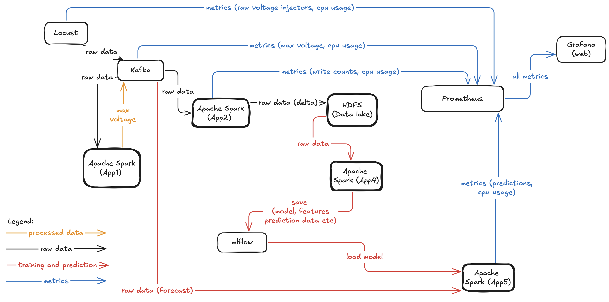
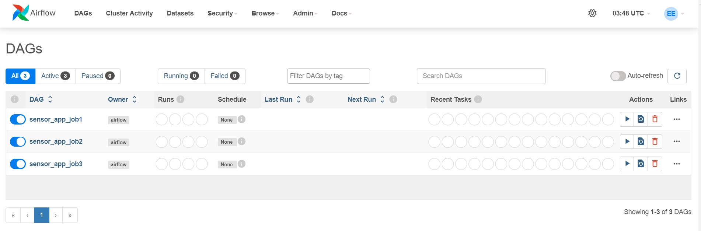
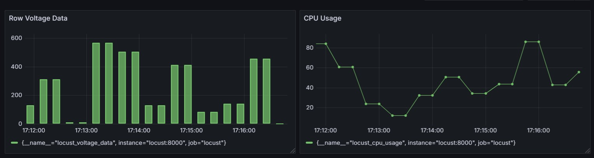

# Team Project: Smart-Meter Application Upgrade

**Course:** MGL7320 - Software Engineering for Artificial Intelligence Systems  
**Instructor:** Laurent Yves Magnin  
**Email:** [magnin.laurent_yves@uqam.ca](mailto:magnin.laurent_yves@uqam.ca)  

**GitHub Organization:**   
**Team Name:**   
**Project GitHub:**   

---

## Team Members

| Name and Surname | Student Email | GitHub Username | Study Program |
| :--- | :--- | :--- | :--- |
| Francois Gonothi Toure | toure.francois_gonothi@courrier.uqam.ca | @gtfrans2re | M.Sc. in Computer Science (Electronic Systems) |
| Ben Bachir Aboubakar Nabil | aboubakar_nabil.ben_bachir@courrier.uqam.ca | @BenBachirAboubakarNabil | M.Sc. in Software Engineering |
| Martial Zachee Kaljob Kollo | kaljob_kollo.martial_zachee@courrier.uqam.ca | @kaljob | M.Sc. in Computer Science (AI and Data Management) |
| Sokhna Mariame Ndour | ndour.sokhna_mariame@courrier.uqam.ca | @zeyda97 | M.Sc. in Computer Science (Artificial Intelligence) |

## Architecture

### Global Architecture

#### Overview of the Smart-Meter Architecture.
The architecture is based on a seamless integration of the following components:

- **Locust**: Simulates smart meter data for load testing.
- **Kafka**: Transmits data between different Spark applications.
- **Apache Spark**: Processes data and performs predictions.
- **HDFS**: Stores transformed data in a Data Lake.
- **MLflow**: Manages machine learning models.
- **Prometheus & Grafana**: Collect and visualize component metrics.
- **Airflow**: Orchestrates data processing and forecasting pipelines.

#### Orchestration with Airflow
Airflow is used to orchestrate processing and prediction pipelines. Airflow DAGs automate the following tasks:

- Data collection via Kafka.
- Data processing by Spark applications.
- Saving trained models in MLflow.
- Pushing metrics to Prometheus.

Access to the Airflow web interface: http://localhost:9095

### Metric Monitoring
Monitoring is handled by Prometheus and Grafana, providing a real-time view of system performance.

Prometheus collects metrics from Spark applications, Locust, Kafka, and Airflow.

Access: http://localhost:9090

### Grafana
Access: http://localhost:3000

**Note**: We worked intensively on upgrading this project, but due to the short timeframe, it was difficult for us to finalize the configuration of Prometheus with the other components. Consequently, we were unable to export all metrics or display them in Grafana. Nevertheless, we have ensured a solid foundation for metric tracking.
